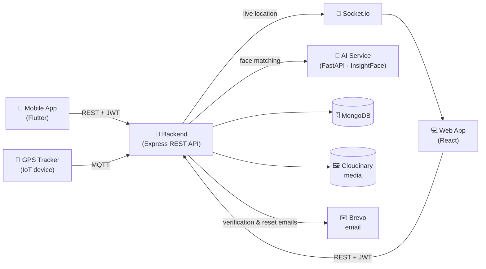

# 🧠 MindMate

### AI-Powered Alzheimer's Care Platform

*Connecting patients, caregivers, and families through intelligent technology*

---

## What is MindMate?

MindMate is a full-stack platform designed to support Alzheimer's patients and their care networks. It combines real-time location tracking, intelligent reminders, memory preservation, face recognition, and IoT integration into one coordinated system — enabling caregivers and families to provide better, more responsive care.

---

## ✨ Core Capabilities

| Feature | Description |
|---|---|
| 🧩 **Face Recognition** | Helps patients recognize loved ones — point the camera at a person and the app says who they are and how they're related (InsightFace) |
| 📍 **Real-Time Location** | Live GPS tracking via Socket.io & MQTT IoT devices, with a location view for caregivers |
| 💾 **Memory Bank** | Store photos, videos, and stories with captions, relations, and tags |
| ⏰ **Smart Reminders** | Medication & appointment reminders with on-device notifications and a full-screen alarm in the mobile app |
| 🚨 **Alert System** | Instant safety alerts with acknowledgment tracking |
| 🔐 **Role-Based Access** | Secure multi-role system for patients, caregivers, and admins |
| ✉️ **Email Notifications** | Account verification and password reset emails via Brevo |

---

## 📱 App Preview

| Patient Home | Face Recognition | Caregiver Dashboard |
|:---:|:---:|:---:|
|  |  |  |

*Full tour with 23 screenshots in the [mobile app README](https://github.com/MindMate-Project/MindMate-app#readme).*

---

## 🏗️ Architecture

How the pieces talk to each other:

The mobile app schedules reminder notifications **on the device itself** from the backend's reminder data — so alarms still fire even with a poor connection.

MindMate is split across four focused repositories:

### 🔷 [Backend](https://github.com/MindMate-Project/Backend)
**TypeScript · Express.js · MongoDB · Socket.io**

REST API and real-time server — the core of the platform. Handles authentication, user management, memories, reminders, alerts, location tracking, and IoT device communication.

### 🔷 [Web](https://github.com/MindMate-Project/Web)
**React · Redux Toolkit · JavaScript**

Web application for patients, caregivers, and family members. Provides dashboards for memory browsing, reminder management, live location viewing, and alert monitoring. **[Live demo →](https://web-mindmate.vercel.app)**

### 🔷 [Mobile App](https://github.com/MindMate-Project/MindMate-app)
**Dart · Flutter · Bloc/Cubit**

Cross-platform mobile application for patients and caregivers. Patients get medication and appointment reminders with a full-screen alarm, a Memory Bank of photos and stories, and a camera flow that recognizes the people around them. Caregivers manage their patients, create reminders and memories, register known people for face recognition, train memory with brain exercises, and check the patient's location.

- **One codebase, two platforms** — runs on Android & iOS from a single Flutter project
- **Two tailored experiences** — Patient and Caregiver, chosen at signup
- **Feature-first clean architecture** with Bloc/Cubit state management
- **Offline-friendly reminders** — notifications and alarms are scheduled on-device, so they fire even without a connection

### 🔷 [AI](https://github.com/MindMate-Project/AI)
**Python · FastAPI · InsightFace · ONNX**

Standalone face recognition microservice. Stores face embeddings of the people registered for each patient (family and friends) and identifies who appears in a photo, exposing results through a REST API consumed by the backend.

---

## 🛠️ Tech Stack

| Layer | Technologies |
|---|---|
| **Backend** | Node.js, TypeScript, Express.js v5, MongoDB, Mongoose |
| **Real-Time** | Socket.io, MQTT |
| **Frontend** | React, Redux Toolkit, CSS3, HTML5 |
| **Mobile** | Flutter, Dart, Bloc/Cubit |
| **AI / ML** | Python, FastAPI, InsightFace, ONNX Runtime, OpenCV |
| **Auth & Security** | JWT, bcryptjs, role-based access control |
| **Notifications** | Flutter local notifications (reminders & alarms), Nodemailer + Brevo (email) |
| **Storage** | Cloudinary (media files), MongoDB (data) |
| **DevOps** | Docker · Render (Backend) · Vercel (Web) · AWS EC2 + GitHub Actions (AI) |

*Built with ❤️ to improve the quality of life for Alzheimer's patients and their families.*

